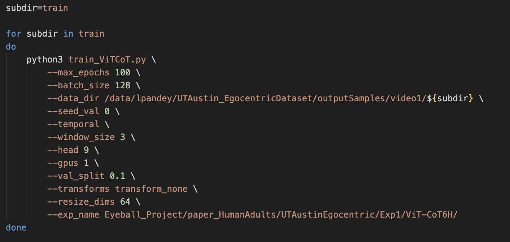

# I. Environment Setup

### Step 1: Check python version. 
Your python version should be 3.11.5 or greater to successfully install all the required libraries. If don't have access to python==3.11.5 or greater, then create a conda environment as shown in the next step. 
<br><br>
To check your python version - 

```python
python3 --version
```

### Step 2: Creating a virtual Environment.
You need a virtual environment to install all the libraries required to run our models. A virutal environment can be created either using 'conda' or 'venv'. If you system has an older version of python then use conda otherwise use venv.

```python
# Option1: create a virtual environment using conda
conda create --name myenv python=3.11.5 
# replace myenv with your desired env name
```

```python
# Option2: create a virtual environment using venv
python3 -m venv myenv 
# replace myenv with your desired env name
```

### Step 3: Activate virtual environment.
After creating your virtual environment, activate it to install libraries inside that env.

<b>Note:</b> If you used option1 to create virtual env, then activate using - 

```
conda activate myenv
```

<b>Note: </b> If you used option2 to create virtual env, then navigate to the dir where the virtual environment is created and activate using - 

```
source myenv/bin/activate
```

### Step 4: Installing libraries.
A requirement.txt file is present with this repo which has a list of all the required libraries. Install it using - 

```python3
pip3 install -r requirements.txt
```

<b>Note:</b> If any of the libraries fail to install, then recheck your python version as shown in step 1.

<br>

# II. Dataset Setup

### Step 1: Downloading dataset.
To replicate our results, you only need UT Austin Egocentric Data consisting of three video datasets. Each video dataset consists of 80,000 samples of 64x64 resolution images. Download the dataset from the link provided below - 
<br>
<br>
<a href="www.google.com">Dataset</a>

<b>Note: </b>If you don't have access to the dataset, email: lpandey@iu.edu and access will be given to you at the earliest.

<br>

# III. Model Training

### Step 1.
Enter the project directory and make sure that your virtual environment is active.

### Step 2.
Type the following command to get familiar with the type of arguments required when training a model -

```python
# make sure you are in the dir where this file is located
python3 train_ViTCoT.py --help
```

<b>Note:</b> If you don't see a list of arguments on your terminal and encounter an error, it means that 'Environment Setup' was not successful. Raise a GitHub issue and we will help you solve your issue at the earliest.

### Step 3.

Open and modify <b>train_ViTCoT.sh</b> as per the choice of your experiment. You can change the number of GPUs, temporal window size, architecture size, experiment name, shuffling and many other arguments in this file before training the model.

<b>Example - </b>

</img>

